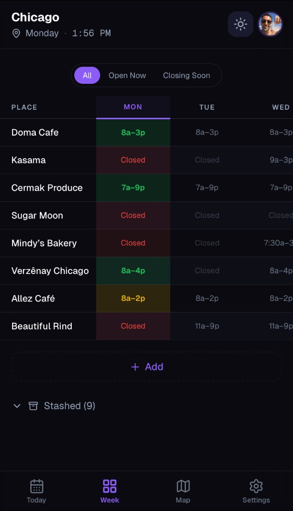

# OpenNow

A travel app that shows which saved places are open right now, closing soon, or closed.

**Live at [getopennow.com](https://getopennow.com)**



## Why I built it

My girlfriend was visiting me in Philly for four days, and we had a long list of spots we wanted to eat at. Picking places was easy. Figuring out what was actually open when we had time was the hard part.

I made a color-coded Google Sheet so we could see it all at a glance. It worked so well I kept using it on every trip after that, and eventually decided to turn it into a real app.

## What it does

- Save restaurants, cafes, and bars to city-based trip lists
- Show live status for each place: open, closing soon, or closed
- Add places fast with Google Places search
- Switch between a today list, weekly view, and map view
- Keep using it in guest mode, or sign in to sync your data

## Tech stack

- Next.js 16 (App Router)
- TypeScript
- Tailwind CSS 4
- NextAuth.js (Google OAuth)
- Supabase (Postgres)
- Zustand
- Sentry
- Vercel

## Getting started

```bash
# 1) Install dependencies
npm install

# 2) Create local env file
cp .env.local.example .env.local

# 3) Add required keys to .env.local
# - Google OAuth
# - Google Places / Maps
# - Supabase
# - NextAuth secret

# 4) Run the app
npm run dev
```

Then open [http://localhost:3000](http://localhost:3000).

## Project structure

```text
.
├── app/           # Pages + API routes (App Router)
├── components/    # Shared UI building blocks
├── lib/           # Core logic (db, auth, places, status engine)
├── store/         # Zustand state
├── supabase/      # SQL migrations
├── types/         # TypeScript types
├── public/        # Static assets + icons
└── docs/          # Notes, research, and playbooks
```

## Notes

A key design choice was separating status logic from the UI. The app has a dedicated status engine (`lib/status-engine.ts`) so open/closed/closing-soon rules stay consistent across list, map, and weekly views. I also kept a guest mode so the app still works without auth or external services.
